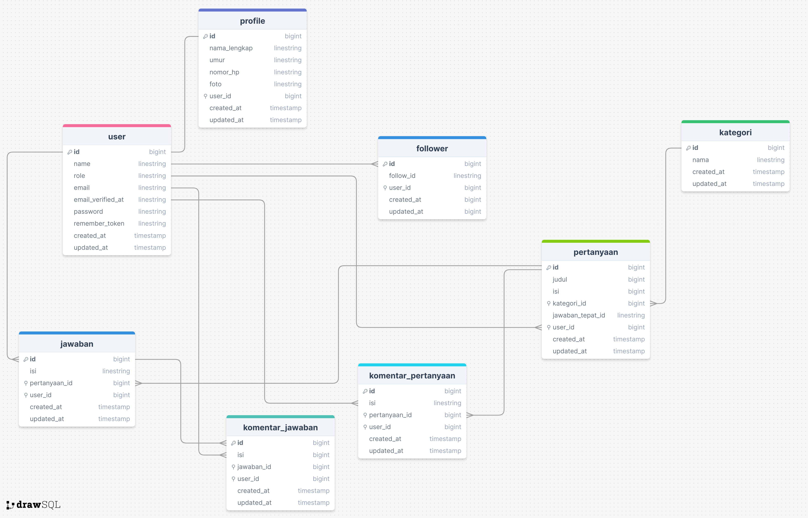

## Final Project

## Anggota Kelompok

-   Rio Eka Saputra (@Rioekasaputra59)
-   Ryan Habuci (@ryanhabuci6632)
-   Herman Jaya (@Hermanjaya8765)
-   Rayhan Akbar (@rayhanakbar5141)
-   Nadem Lijed (@Nadem74)

## Tema Project

Forum Disku

## Penjelasan

Sistem forum tanya jawab ini dibangun menggunakan laravel 8 yang terdiri dari user biasa dan admin adapun menu/fitur yang terdapat
disistem ini sebagai berikut:

-   Crud Pertannyaan
-   Input Komentar Pertanyaan
-   Crud Jawaban
-   Input Komentar Jawaban
-   Crud Kategori
-   Crud User
-   Edit Profile

Adapun alur sistem forum tanya jawab ini adalah, pertama user harus registrasi untuk membuat akun setelah akun dibuat kemudian login jika berhasil login user
akan ditampilkan halaman list pertanyaan user dapat membuat, mengedit dan menghapus pertanyaan kemudian user dapat mengcrud kategori, user juga dapat memberikan komentar pada pertanyaan dan jawban, user juga dapat mengubah jawaban yang telah diinput, user juga dapat mengubah profile.

Halaman admin terdapat menu forum tanya jawab seperti user biasa dan admin pada halaman admin berfungsi untuk mengelola data tanya jawab crud pertanyaan, jawaban, user dan kategori.

## ERD

## Link Video

-   Link Youtube Video Aplikasi : [https://youtu.be/YipI9YQt-Hk](https://youtu.be/YipI9YQt-Hk).
-   Link Deploy : [https://deploy-disku.desaangkasa.com/](https://deploy-disku.desaangkasa.com/).
